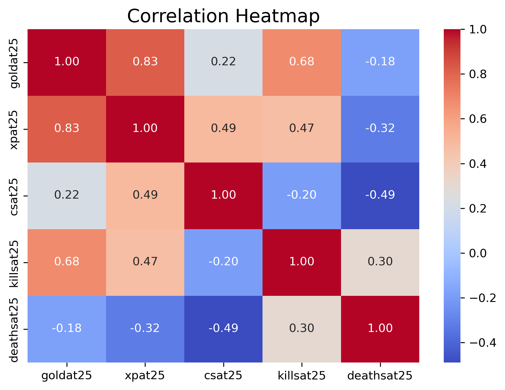

# Categorization Model of Predicting LOL Game Outcomes

**Authors:**
- Xingzhi Cui ([tigercui@umich.edu](mailto:tigercui@umich.edu))
- Yun Jong Na ([kevinyjn@umich.edu](mailto:kevinyjn@umich.edu))

---

## Table of Contents

1. [Introduction](#introduction)  
2. [Data Cleaning and Exploratory Data Analysis](#data-cleaning-and-exploratory-data-analysis)  
3. [Framing a Prediction Problem](#framing-a-prediction-problem)  
4. [Baseline Model](#baseline-model)  
5. [Final Model](#final-model)  
6. [Installation & Usage](#installation--usage)

---

## Introduction

In this project, we explore whether in-game features at the 25 minute cutoff can accurately predict the outcome (win/loss) of League of Legends matches. Our full dataset consists of approximately **9800** matches in 2024 sourced from OraclesElixir, which is a public dataset under Riot Games, containing information on champion selections, team compositions, player roles, and match metadata.

- **Central Question:** Can a classification model leverage in-game kills, gold, experience information at the 25 minute checkpoint to predict the game result?
- **Motivation:** Predictive insights can inform esports strategy and enhance spectator engagement by offering data-driven match forecasts.  
- **Dataset Details:**  
  - **Rows:** 117600, 2 rows per game
  - **Relavant Features:**
    - `gameid`: A unique identifier for each game
    - `goldat25`: Team’s total gold collected by minute 25  
    - `xpat25`: Team’s total experience points gained by minute 25  
    - `csat25`: Team’s total creep score (minion kills) by minute 25  
    - `killsat25`: Total kills achieved by the team by minute 25  
    - `assistsat25`: Total assists by the team by minute 25  
    - `deathsat25`: Total deaths suffered by the team by minute 25 
    - `opp_goldat25`: Opponent team’s total gold collected by minute 25  
    - `opp_xpat25`: Opponent team’s total experience points gained by minute 25  
    - `opp_csat25`: Opponent team’s total creep score by minute 25  
    - `opp_killsat25`: Total kills achieved by the opponent team by minute 25  
    - `opp_assistsat25`: Total assists by the opponent team by minute 25  
    - `opp_deathsat25`: Total deaths suffered by the opponent team by minute 25 
    - `golddiffat25`: Gold difference at minute 25 (`goldat25 – opp_goldat25`)  
    - `xpdiffat25`: Experience difference at minute 25 (`xpat25 – opp_xpat25`)  
    - `csdiffat25`: Creep score difference at minute 25 (`csat25 – opp_csat25`)  
    
  - **Target Variable:** `result` (win = 1, loss = 0)  
  
  - **Relevance:** Accurate prediction models support coaches and analysts in optimizing in‑game decisions and contribute to the broader field of sports analytics.

---

## Data Cleaning and Exploratory Data Analysis

1. **Row Selection** 
- **League filter:** Restrict to the six major leagues (WLDs, LCK, LPL, LEC, LTA, LCP).  
- **Level filter:** From the original 12 rows per match, keep only the two **team‑level** records (`data = data[data['position'] == 'team']`); discard all player‑level entries.

2. **Feature Selection**  
- Restricted to features measured at 25 minutes.  
- Removed time‑static variables (e.g. total dragons slain).  
- Dropped perfectly collinear stats (ex: `killsAs25` vs. `opp_deathsAt25`) to aid interpretability.

3. **Imputation Strategies and Missing‑Value Handling**
- **Assessment of missingness:** We found that rows lacking any 25‑minute metric (gold, kills, objectives, etc.) account for roughly **46.58%** of our team‑level data.
- **Rationale for dropping:** A missing 25‑minute value indicates that the game state wasn’t recorded at that cut‑off, so these rows contain no usable mid‑game information. Imputing them would introduce unfounded assumptions, so we removed all records with missing 25‑minute features. ​

**Head of Cleaned Data:**

```
| gameid          |   result |   goldat25 |   xpat25 |   csat25 |   killsat25 |   deathsat25 |   opp_goldat25 |   opp_xpat25 |   opp_csat25 |
|:----------------|---------:|-----------:|---------:|---------:|------------:|-------------:|---------------:|-------------:|-------------:|
| LOLTMNT06_13630 |        0 |      45581 |    53080 |      904 |           9 |            7 |          44394 |        55632 |          899 |
| LOLTMNT06_13630 |        1 |      44394 |    55632 |      899 |           7 |            9 |          45581 |        53080 |          904 |
| LOLTMNT06_12701 |        0 |      40305 |    50828 |      864 |           4 |            9 |          44748 |        57191 |          878 |
| LOLTMNT06_12701 |        1 |      44748 |    57191 |      878 |           9 |            4 |          40305 |        50828 |          864 |
| LOLTMNT06_13667 |        0 |      43673 |    55802 |      900 |           6 |            7 |          42984 |        54096 |          893 |
```

**TODO: Univariate Analysis**

**TODO: Bivariate Analyses and Aggregations**

### Issues with Multicollinearity

Even after dropping the most obvious redundancies, many of our 25‑minute features remain highly correlated. For example, teams that secure more kills typically accumulate more gold and experience, while opponents with higher death counts correspondingly lag behind. This interdependence can lead to unstable coefficient estimates in a standard logistic regression. Therefore, in the following regression models, we will need to either address these issues or interpret the results with causion. 




## Framing a Prediction Problem

- **Task:** Binary classification of match outcome, `result` (1 = win, 0 = loss).  
- **Features:** All in‑game metrics available at the 25 minute mark **after** the filtering and cleaning steps described in [Data Cleaning and Exploratory Data Analysis](#data-cleaning-and-exploratory-data-analysis). We exclude any variables that aren’t known at minute 25 (e.g. final kill totals).  
- **Evaluation Metric:** **Accuracy**, defined as the proportion of correct predictions:
  $$
    \text{Accuracy}
    = \frac{\text{Number of correct predictions}}{\text{Total number of predictions}}
    = \frac{1}{N}\sum_{i=1}^{N} \mathbf{1}\bigl(y_i = \hat y_i\bigr),
  $$
  where \(y_i\) is the true label and \(\hat y_i\) is the model’s prediction.  
- **Prediction Question:**  
  > Can a classifier, given only kills, gold, XP, creep‑score, and objective metrics at minute 25, accurately predict which team will win the match?


## Baseline Model

To establish a performance benchmark, we trained a **simple logistic regression** on our 25‑minute features.  

**1. Data Partitioning**  
We split the cleaned dataset into training (70%) and test (30%) sets, preserving the win/loss balance via stratification:

```python
from sklearn.model_selection import train_test_split

y = data['result']
X = data[[
    'goldat25', 'xpat25', 'csat25',
    'killsat25', 'deathsat25',
    'opp_goldat25', 'opp_xpat25', 'opp_csat25'
]]

X_train, X_test, y_train, y_test = train_test_split(
    X, y,
    test_size=0.30,
    stratify=y,
    random_state=123
)
```

**Baseline Model Pipeline:**

```python
from sklearn.pipeline import make_pipeline
from sklearn.preprocessing import StandardScaler
from sklearn.linear_model import LogisticRegression
from sklearn.metrics import accuracy_score, roc_auc_score
import numpy as np

pipeline = make_pipeline(
    StandardScaler(),
    LogisticRegression(
        penalty='l2',
        solver='liblinear',
        random_state=398
    )
)

pipeline.fit(X_train, y_train)

# Predictions
y_test_pred = pipeline.predict(X_test)
y_train_pred = pipeline.predict(X_train)

# Metrics
test_acc   = accuracy_score(y_test,   y_test_pred)
train_acc  = accuracy_score(y_train,  y_train_pred)
roc_auc    = roc_auc_score(y_test,    pipeline.decision_function(X_test))
num_coeffs = np.count_nonzero(pipeline.named_steps['logisticregression'].coef_)

# Tabulate results
results = {
    'Train Accuracy': train_acc,
    'Test Accuracy':  test_acc,
    'ROC‑AUC':        roc_auc,
    'Non‑zero Coeff': num_coeffs
}
```

**Model Information**

```
| Data Type    | Features                                                                                                       | Processing Method |
|--------------|----------------------------------------------------------------------------------------------------------------|-------------------|
| Quantitative | `goldat25`, `xpat25`, `csat25`, `killsat25`, `deathsat25`,<br>`opp_goldat25`, `opp_xpat25`, `opp_csat25`      | `StandardScaler`  |
| Ordinal      | –                                                                                                              | –                 |
| Nominal      | –                                                                                                              | –                 |
```


**Results Output**
```
| Model Name                                   |   num_non_zero |   training_accuracy |   testing_accuracy |   ROC_accuracy |
|:---------------------------------------------|---------------:|--------------------:|-------------------:|---------------:|
| Baseline_Simple_Logistic_Regression          |              8 |            0.839506 |           0.817658 |       0.91107  |
```

**Model Analysis**

The baseline logistic regression achieves 84.0% accuracy on the training set and 81.8% on the test set, with a ROC‑AUC of 0.911—indicating strong overall discrimination between wins and losses. However, the presence of multicollinearity among mid‑game features, as indicated in [Issues with Multicollinearity](#issues-with-multicollinearity), suggests that regularized models or dimensionality‑reduction techniques may further improve stability and performance in subsequent modeling steps.


